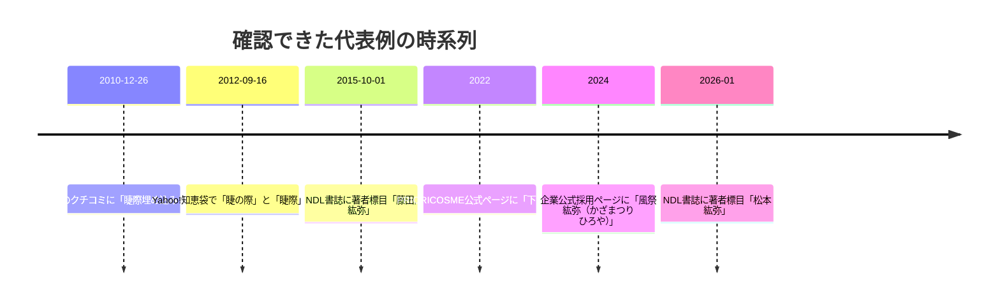

# 睫際と紘弥の文献調査報告

## 要約

本調査で確認できた範囲では、**「睫際」**は、公開ウェブ上の主要な日本語辞書・古典本文では確実な立項例を確認できず、**現代の美容・メイク文脈で散発的に現れる表記**でした。とくに重要なのは、2012年の用例で**同一回答内に「睫の際」と「睫際」が併記**されている点で、これにより「睫際」は独立した古い成語というより、**「睫の際」あるいは「まつげ際」を漢字二字に圧縮した実用表記**である可能性が高いと判断できます。意味はほぼ確実に**「まつげの生え際・アイラインを入れる位置」**です。読みは資料にふりがながなく**不詳**ですが、文脈上は**まつげぎわ／まつげのきわ**が最有力です。字音から作れば**しょうさい**も候補にはなりますが、今回の出典群では裏づけが取れませんでした。なお、構成字のうち「睫」はJIS第2水準・漢検1級で、字そのものが一般的でないことも、この語形の稀少さを後押しします。 citeturn33view0turn30view0turn31view0turn75view0turn76view0

一方、**「紘弥」**は語彙ではなく、**現代日本の男性名として実在する表記**であることが確認できました。一次資料としては、国立国会図書館サーチに**2015年の「藤田, 紘弥」**、**2026年の「松本 紘弥」**という著者標目があり、さらに企業公式採用ページに**「風祭 紘弥（かざまつり ひろや）」**という、読みを伴う確実例があります。したがって、少なくとも現代の人名表記としては実在が確定します。読みは一次資料で確認できたものとしては**ひろや**、補助的な名付け辞典では**こうや・ひろや・ひろみ**が候補に挙がります。意味は構成字からみて、**紘＝広く大きい・大綱、弥＝あまねく広がる・ますます**という方向に解釈するのが妥当です。頻度は高くなく、補助資料でもランキング外であり、**稀だが実在する名前**とみるのがもっとも慎重なまとめです。 citeturn44view0turn45view0turn45view1turn70view0turn70view1

## 調査範囲と方法

調査は、まず公開アクセス可能な**一次・準一次資料**を優先し、国立国会図書館サーチ、公式機関サイト、企業・団体の公式ページを軸に行いました。そのうえで、用例の少ない語については、実際の使用場面を拾うために、公開ウェブ上の日本語ページを検索し、**表記揺れ・省略形・異体字候補**を展開して追跡しました。検索語の拡張は、**睫際／睫の際／まつげ際／睫毛際／下睫際**、および**紘弥／紘彌／弘弥／宏弥／紘也／紘矢／ひろや／こうや／ひろみ**を中心に行っています。

ただし、契約型の国語辞典・漢和辞典、館内限定の新聞記事データベース、戸籍原簿そのものなど、**この環境から直接照会できない資料**は残っています。そのため、本報告の「不詳」は、**公開アクセス可能な範囲で不詳**という意味です。なお、原典URLの生表示は省き、**各 citation から原典ページ・書誌レコードに遷移できる**形にしています。

## 時系列の概観

今回、確実に確認できた主要例だけを並べると、**「睫際」は2010年代以降のメイク文脈に集中**し、**「紘弥」は2015年以降の人名実例として散発的に現れる**、という対照的な分布が見えます。 citeturn30view0turn33view0turn31view0turn45view0turn44view0turn45view1

## 睫際

まず結論を先に言うと、**「睫際」は、今回確認できた限りでは、美容・メイクの実用文脈に偏る稀語**です。古典・近代の確実な出典は本調査では未確認でしたが、現代日本語の実使用例は複数確認でき、その意味は**まつげの際、すなわち lash line**と解するのがもっとも自然です。とりわけ2012年の用例で「睫の際」と「睫際」が同一文脈に共存することが、語義推定の決め手になりました。さらに日本眼科学会の一般向け解説では、まつげが「**まぶたの縁から外側へ**」生えると説明されており、「睫際」を「まつげの生え際・まぶたの縁」とみる解釈を補強します。 citeturn33view0turn31view0turn30view0turn76view0

| 出典 | 用例引用 | 読み | 意味推定 | 時代・ジャンル | 備考 |
|---|---|---|---|---|---|
| 美容メディア VOCE のクチコミ一覧 | 「**睫際埋め込みライン**をバッチリ決めたい」。 citeturn30view0 | 不詳。文脈上は**まつげぎわ**が最有力。 | アイライナーを**まつげの生え際に沿って入れる線**。 | 2010年・美容口コミ | HTML原文あり。語がそのまま現れる最古級の確認例。 |
| Yahoo!知恵袋ベストアンサー | 「赤系のシャドウを**睫の際**から…」「黒のライナーを**睫際**に入れる。」。 citeturn33view0 | 不詳。ここでは**睫の際＝睫際**と読めるため、**まつげのきわ／まつげぎわ**が有力。 | **「睫の際」から「睫際」への省略・漢字圧縮**を直接示す用例。 | 2012年・美容Q&A | 同一回答内で両表記が並存する点が重要。スキャンなし。 |
| PRIORICOSME 公式メイク解説 | 「…ベージュ(442)で**下睫際**のまぶた目幅にのせます。」。 citeturn31view0 | 不詳。実用上は**したまつげぎわ**相当。 | **下まぶた側のまつげ際**、すなわち lower lash line。 | 2022年・企業公式メイク解説 | 公式ページ上の整った使用例。HTML原文あり。 |

この語の**読み**は、直接示す一次資料が見つからず**不詳**です。ただし、構成字のうち「睫」は漢字辞典で**音読みショウ、訓読みまつげ**とされており、現代のメイク文脈での実用性を考えると、**まつげぎわ／まつげのきわ**がもっとも自然です。理屈のうえでは、音読みに寄せて**しょうさい**という候補も作れますが、今回見つかった実例はすべてメイク手順文で、しかも「睫の際」との対応関係が見えるため、**実際の運用読みとしては和語読みが優勢**とみるべきでしょう。 citeturn75view0turn33view0turn31view0

**頻度・希少性**については、厳密なコーパス頻度は本環境では出せず**不詳**です。ただし、公開ウェブで確実に拾えた用例は、VOCEのクチコミ、Yahoo!知恵袋のメイク回答、PRIORICOSMEのメイク解説といった**美容実用文脈に集中**しており、しかも語幹としては**下睫際**のような派生も見られます。これに対し、「睫」自体はJIS第2水準・漢検1級で、日常的な漢字ではありません。したがって「睫際」は、**口頭では身近な概念だが、文字面としてはかなり限定的・業界寄りの表記**と推定するのが穏当です。 citeturn30view0turn31view0turn33view0turn75view0

表記揺れとしては、今回の検索で有力だったのは**睫の際**、**睫際**、**下睫際**でした。ユーザー指定の観点に沿っていうと、**誤記というより省略・合成語化**の可能性が高く、少なくとも2012年の実例では「睫の際」が先に書かれ、その後に「睫際」が現れるため、書き手の中で両者がほぼ同義に扱われていたとみられます。逆に、古典語・医学古語として固定した表題語である、という証拠は今回の公開資料からは得られませんでした。 citeturn33view0turn31view0

## 紘弥

**「紘弥」は、確認できた実例のすべてで人名、しかも男性名として機能している**ことがわかりました。語彙としての普通名詞・地名・古典語の実例は、本調査では確実には確認できていません。一次資料として強いのは、国立国会図書館サーチの著者標目と、企業公式採用ページのフルネーム表記です。これだけで、少なくとも**2015年以降の現代日本で実在する名**であることは十分にいえます。 citeturn45view0turn45view1turn44view0

| 出典 | 用例引用 | 読み | 意味推定 | 時代・ジャンル | 備考 |
|---|---|---|---|---|---|
| NDLサーチ掲載記事書誌 | 著者標目「**藤田, 紘弥**」。 citeturn45view0 | 不詳。 | 人名。姓＋名のうち、**名が「紘弥」**。 | 2015年・医学論文著者名 | NDL書誌に外部本文URIあり。本文は今回直接確認できず。 |
| 仙台ターミナルビル採用サイト | 「**風祭 紘弥（かざまつり ひろや）**」。 citeturn44view0 | **ひろや**。 | 現代男性名。 | 2024年・企業公式プロフィール | 読みが一次資料で明示された最重要例。 |
| NDLサーチ掲載記事書誌 | 著者標目「**松本 紘弥**」。 citeturn45view1 | 不詳。 | 人名。現代の著者名として実在。 | 2026年・医学論文著者名 | 書誌のみ確認。掲載誌は『腫瘍内科』。 |

**読み**については、一次資料で確定できたのは**ひろや**だけです。企業公式ページが「風祭 紘弥（かざまつり ひろや）」と明示しており、これは強い証拠です。他方、補助的な名付け辞典では、**こうや・ひろや・ひろみ**が候補として列挙されています。したがって、「紘弥」の読みに唯一絶対の固定は見えませんが、**現実の実例としてはひろやが確認済み**、そのほかは**名付け慣行上の候補**と整理するのが適切です。 citeturn44view0turn70view0turn70view1

**意味の推定**は字義からかなり整然と行えます。補助資料によれば、「紘」は**太い糸・大綱・広い／大きい**、「弥」は**広く行き渡る・あまねく・いよいよ・ますます**です。したがって「紘弥」は、人名としては、**大きく広がる、器量が広い、ますます伸びていく**といった吉祥的な意味づけが自然です。これは命名辞典側の説明とも整合します。 citeturn70view0turn70view1

**頻度・希少性**については、こちらも厳密な全国統計は本環境では出せず**不詳**です。ただし、補助資料の一つでは「紘弥」は**2017年以降の人気ランキングに未ランクイン**とされており、また実地に確認できた一次資料も**2015年の論文著者、2024年の企業プロフィール、2026年の論文著者**という散発的なものです。この分布からは、**存在は確実だが、一般的・高頻度の名とは言いにくい**という評価が妥当です。 citeturn70view0turn45view0turn44view0turn45view1

検索拡張の観点では、**紘彌**は旧字体候補、**弘弥・宏弥・紘也・紘矢**は読みの近い類縁表記候補として重要です。今回の公開検索で一次資料として確実に拾えたのは**紘弥**そのものだけでしたが、補助的な命名辞典では同じ**ひろや**系の表記として**紘也・宏弥・紘矢**が並んでおり、実社会では**読みは共通でも字面は競合しやすい名**であることがわかります。旧字体の**紘彌**については、本調査の公開アクセス範囲では**確実な一次資料ヒットは未確認**でした。 citeturn70view1turn70view0

## 総括

二語は性質がまったく異なります。**「睫際」**は、少なくとも今回の公開資料では**辞書化された一般語というより、現代美容文脈で「睫の際」を縮約した実用表記**として現れます。意味は実質的に**まつげの生え際**でよく、読みは**まつげぎわ系**が最有力ですが、資料上は**不詳**のまま残すのが厳密です。 citeturn33view0turn30view0turn31view0turn75view0

これに対して**「紘弥」**は、**現代の男性名として実在が確認できる表記**です。一次資料で読みに確証があるのは**ひろや**で、補助資料では**こうや・ひろみ**も候補に現れます。字義からの意味づけは比較的明瞭で、**広がり・大きさ・ますますの発展**を志向する命名語意が推定されます。ただし、名としては**少数派**であり、類縁表記との競合が大きい点もあわせて押さえるべきです。 citeturn44view0turn45view0turn45view1turn70view0turn70view1

以上を厳密にまとめると、**「睫際」は稀少な現代表記、意味はほぼ確定・読みは不詳**、**「紘弥」は稀少だが実在する現代男性名、読みは少なくとも「ひろや」が一次資料で確認済み**、というのが、現時点でのもっとも慎重かつ資料準拠の結論です。 citeturn31view0turn33view0turn44view0turn45view0turn45view1turn70view0turn70view1